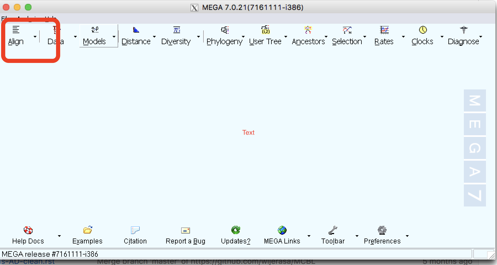
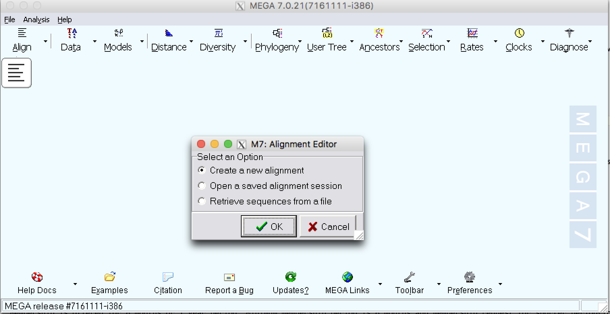
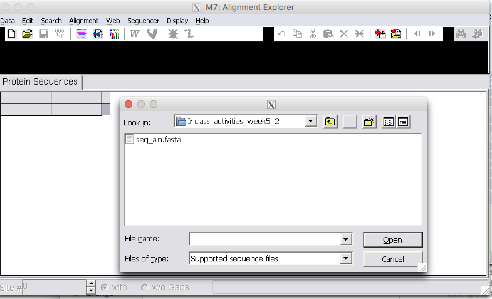
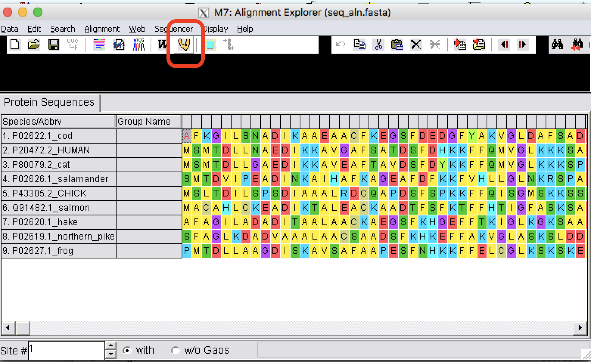

.. module:: In_class activities Week 6
   :synopsis: MEGA and sequence alignment  
.. moduleauthor:: Asela Wijeratne<awijeratne@astate.edu>

.. index::

.. highlight:: rest

.. figure:: img/UnivLogo_Stack_2C_Dark.png
   :align: right

*****************************
Multiple Sequence Alignments
*****************************

Getting started with MEGA
--------------------------

.. Note:: There is an excellent `tutorial <http://www.megasoftware.net/webhelp/helpfile.htm#walk_through_mega/hc_first_time_user.html>`_ on the MEGA site and this is excerpt of the tutorial for the exercise. 

How to make an alignment using MEGA
=================================
:Step 1: Open MEGA software and you will see a screen like in the following figure:

:Step 2: Click on the small arrow on the "Align" tab

:Step 3: Click on 'Edit/Build alignment' 

.. figure:: img/mega_2.png

:Step 4: Select a new alignment.

:Step 4: Select protein

.. figure:: img/mega_4.png

:Step 5: From file open, select "seq_align2.fasta" and open file. 

:Step 6: From Edit, select all sequences. To do an alignment using Muscle,  click on Muscle tab. 

:Step 7: Use default options and perform an alignment. To learn more about the options, go to the `MEGA manual <http://www.megasoftware.net/webhelp/helpfile.htm#walk_through_mega/hc_first_time_user.htm>`_.

MCBL Membership Benefits
------------------------

- Access to MCBL and most powerful `MCBL computers <http>`_  24/7.
- Free access to MCBL Workshops and Bioinformatic user group meetings.
- Access to 1 TB data storage space for the duraton of the membership.

MCBL Membership Duration
------------------------
Membership is offered for 6 months or 1 year period. Minimum membership period is 6 months and membership request for shorter period(less than 6 months) won't be considered.

MCBL Membership Termination
----------------------------
MCBL Membership will be terminated after membership period over or upon written request from user or PI to terminate the membership. 

Contacts
---------

.. csv-table::
   :header: "Person", "Information"
   :widths: 10, 40

   `Dr. Vitor Pavinato <mailto:correapavinato.1@osu.edu>`_,Questions regarding membership
   `Saranga Wijeratne <mailto:wijeratne.3@osu.edu>`_, MCBL Server access and remote access
   `Jody Whittier <whittier.2@osu.edu>`_,MCBL payments

   

   

