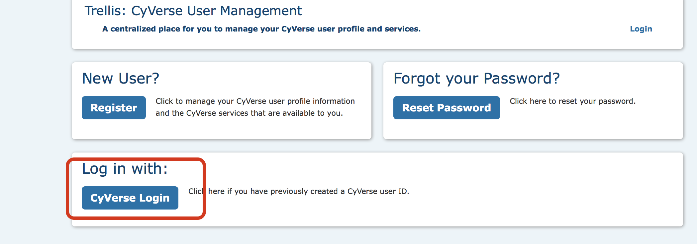
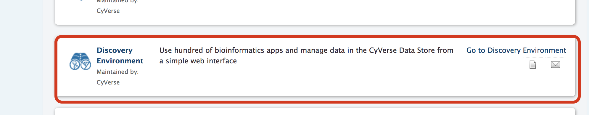

.. module:: FastQC analysis using Cyverse Discovery Environment 
   :synopsis:    
.. moduleauthor:: Asela Wijeratne<awijeratne@astate.edu>

.. index::

.. highlight:: rest

.. figure:: img/UnivLogo_Stack_2C_Dark.png
   :align: right

*********************************************************
FastQC analysis using Cyverse Discovery Environment (DE)
*********************************************************

Data we are using for this analysis came from Loraine et al, 2015 study. In the original study,
there are 10 samples (Five Controls and heat treated). Here we are using only 3 samples for each 
group (3 control and 3 heat treated). These files were downloaded from NCBI's Short Read Archive (SRA)
using SRA `toolkit <http://www.ncbi.nlm.nih.gov/Traces/sra/sra.cgi?view=toolkit_doc>`_.

First step of the data analysis is to check the quality of the sequences. For this purpose,
we are using the `FastQC <http://www.bioinformatics.babraham.ac.uk/projects/fastqc/>`_ tool on Cyverse DE. 

:Step 1: **Login into Cyverse DE**
------------------------------------------
First login to your Cyverse account using your name and password. 

Then, go to your DE account.

|
|

:Step 2: **Getting data into Cyverse Discovery Environment**
----------------------------------------------------------------
|
a. Click on "Data" button
	
	.. figure:: img/fastqc_1.png
	

|
	
b. Click on "File" and then "New Folder"

	.. figure:: img/fastqc_2.png
	
	

|

:c. Create a folder called "Data" and click "OK". Create another folder called "Analysis". 

	.. figure:: img/fastqc_4.png
	
	
|

d. Click on the "Data" folder to enter into it. Click on "Upload" and then "Import from URL"

	.. figure:: img/fastqc_5.png
	
|	
e. I have create public links for fastq files. Copy and paste URLs in the box (one for each box).

	**You will need to do this for all 12 URLs.** Then click on "Import from URL"
	
|

	.. figure:: img/fastqc_6.png

|
**URLs**

http://de.cyverse.org/dl/d/5B50EFE6-D0BA-4833-980E-E81E5B63C15E/Control1_1.fastq

http://de.cyverse.org/dl/d/BBFB60AC-8855-40AC-9634-7C62F5B9B02D/Control1_2.fastq

http://de.cyverse.org/dl/d/2AB5824F-73BA-4C6B-8530-457609F632BA/Control2_1.fastq

http://de.cyverse.org/dl/d/46E690E4-C4A0-495F-9B11-F12AD9A25EE3/Control2_2.fastq

http://de.cyverse.org/dl/d/7FEE6359-24AE-478D-A0B1-C6D2CA09E45E/Control3_1.fastq

http://de.cyverse.org/dl/d/8FBB264D-F0CA-4F2C-821A-DB1C709315B2/Control3_2.fastq

http://de.cyverse.org/dl/d/E7AD135C-F2BC-445C-BBC2-695B1D76B010/Heat1_1.fastq

http://de.cyverse.org/dl/d/46093383-493A-4D4E-A607-D3E56916DF59/Heat1_2.fastq

http://de.cyverse.org/dl/d/9668B243-7009-4AD3-BBDA-350D6A60119D/Heat2_1.fastq

http://de.cyverse.org/dl/d/FE1C3CC3-9133-4244-BCBB-816B8D2D5F97/Heat2_2.fastq

http://de.cyverse.org/dl/d/D635B6EE-BE26-4BC4-A058-3E51B1AA69C4/Heat3_1.fastq

http://de.cyverse.org/dl/d/F88561AF-CFF2-4FC8-B6B4-D8623779BB24/Heat3_2.fastq

	
:Step 3: **Performing FastQC analysis**:	
-------------------------------------------
|

a. Click on "Apps" button.

	.. figure:: img/fastqc_9.png

b. Type "fastqc" in the search window and select app shown in red arrow.

	.. figure:: img/fastqc_10.png
	
|
	
c. Follow the direction as in the figure to select the folder where results will be saved.
	Then, click on the small downward arrow (black circle).
	
	.. figure:: img/fastqc_11.png

d. Click "+" sign to select fastq files.

	.. figure:: img/fastqc_12.png

	
|	

e. Go to the folder where you have your fastq files and select them as indicated in the 
	figure below. Then launch the analysis. Once the analysis is complete, you will be notified
	via email. 

	.. figure:: img/fastqc_13.png
|
|
	

Reference:
----------------------------------------------
**Loraine AE**, Blakley IC, Jagadeesan S, Harper J, Miller G, Firon N. 
Analysis and Visualization of RNA-Seq Expression Data Using RStudio, Bioconductor, 
and Integrated Genome Browser. 
*Methods Mol Biol.* 2015;1284:481-501. doi: 10.1007/978-1-4939-2444-8_24. 
PubMed PMID: 25757788.